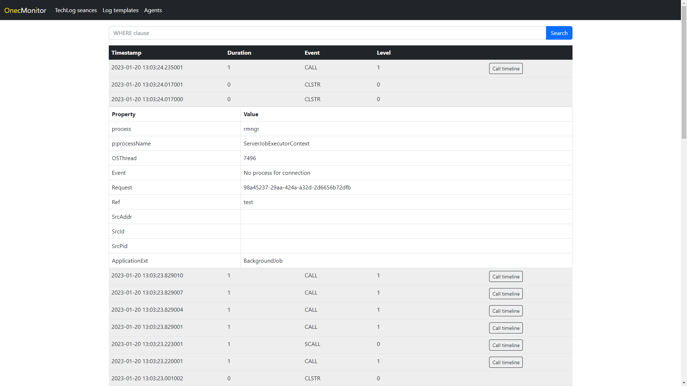
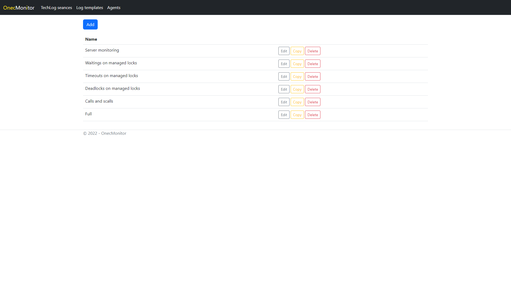
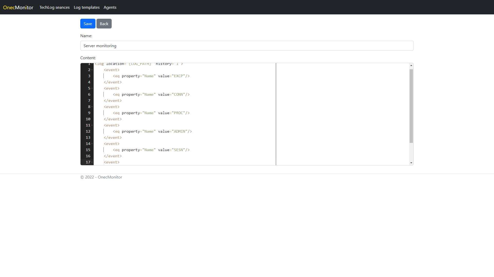

# OnecMonitor

## Служба экспорта и анализа технологического журнала 1С  

Служба решает задачи автоматизации сбора и парсинга действительно больших объемов журнала, в связи с чем, разработка ведется с упором на обеспечение максимальной скорости работы. Хранилищем данных выступает ClickHouse. 
Процесс сбора технологического журнала представляется под концепцией сеансов, каждый из которых может быть запущенных в разных режимах. Сеансу назначается режим сбора, шаблоны logcfg и прикрепляются агенты, которые будут задействованы в сеансе. 

### Функциональные возможности:
- Отображение статуса подключения агентов сбора (Включен/Выключен)
- Управление сбором ТЖ через агентов
- Создание шаблонов файла logcfg.xml
- Несколько режимов сеансов сбора технологического журнала:
  - Немедленный запуск - сеанс сбора запускается сразу после создания и выполняется в течение заданного периода
  - Режим мониторинга - сеанс не имеет ограничений по времени, выполняется до момента удаления сеанса из консоли управления
  - Запланированный - сеансу назначается дата, время и период продолжительности сбора
- Просмотр данных сбора сеансов
- Выполнение анализа цепочек событий

### Установка и использование:
#### Сервер
Устанавливается на любом хосте. В зависимости от объемов поступающих с агентов данных, может потреблять значительные ресурсы при парсинге и анализе. Может быть запущен как служба/демон. Пример конфигурационного файла (appsettings.json):
```json
{
  "Logging": {
    "LogLevel": {
      "Default": "Information",
      "Microsoft.Hosting.Lifetime": "Information"
    }
  },
  "AllowedHosts": "*",
  "Kestrel": {
    "EndpointDefaults": {
      "Protocols": "Http1AndHttp2"
    }
  },
  "ClickHouse": {
    "Host": "127.0.0.1",
    "Port": 8123,
    "Database": "onecmonitor",
    "User": "default",
    "Password": ""
  },
  "OnecMonitor": {
    "Tcp": {
      "Host": "0.0.0.0",
      "Port": 7001
    },
    "Http": {
      "Host": "0.0.0.0",
      "Port": 7002
    }
  }
}
```
Где:
- ClickHouse - параметры подключения к экземпляру clickhouse
- OnecMonitor
  - Tcp - адрес и порт, по которым сервер будет прослушивать подключающиеся агенты
  - Http - адрес и порт, по которым будет доступна веб-панель консоли управления
    
#### Агент
Устанавливается непосредственно на сервера 1С. Ресурсов потребляет совсем немного, так как основная работа по разбору осуществляется на сервере. Так-же может быть запущен как служба/демон. Пример конфигурационного файла (appsettings.json):  
```json
{
  "Logging": {
    "LogLevel": {
      "Default": "Information",
      "Microsoft.Hosting.Lifetime": "Information"
    }
  },
  "Agent": {
    "InstanceName": ""
  },
  "TechLog": {
    "LogCfg": "C:\\Program Files\\1cv8\\conf\\logcfg.xml",
    "LogFolder": "C:\\techlog"
  },
  "OnecMonitor": {
    "Host": "127.0.0.1",
    "Port": 7001
  }
}
```
Где:  
- Agent
  - InstanceName - наименование агента, отображаемое в панели управления серверной части. Если не задано - то hostname
- TechLog
  - Logcfg - путь к файлу logcfg экземпляра сервера (пользователь, из под которого запущен агент, должен обладать правами на изменение файла)
  - LogFolder - каталог, в который будет осуществляться сбор (автоматически подставляется в logcfg через параметр шаблона)
- OnecMonitor - адрес и порт, по которым агент будет стучаться к серверной части

### Приложение и документация в разработке. До релиза функциональность и внешний вид интерфейса могут непредсказуемо меняться, никакая совместимость не гарантируется!  

### Состав приложения:  
- *onecmonitor-agent* - агент, занимающийся управлением сбора, чтением и отправкой данных технологического журнала для дальнейшей обработки на сервере
- *onecmonitor-server* - сервер, выполняющий основную работу по разбору данных журнала. Предоставляет доступ к веб-панели управления агентами и просмотра обработанных данных  

Приложение позволяет выполнять анализ цепочек событий  

### Доступные анализы:
- *Анализ управляемых блокировок/взаимоблокировок* - отображает waterfall график событий tlock, наглядно показывая, где именно возникла проблема. Удобством анализа является отображение неявно влияющих блокировок на графике (тех, что отсутствуют в WaitConnections, но пересекаются по блокируемым областям с жертвой)  
- *Анализ цепочек вызовов (call/scall)* - так-же отображает waterfall график. Позволяет увидеть наиболее длительные участки кода  

Доступные анализы (и функционал в целом) по мере доработки будут пополняться.

<p float="left">




</p>
