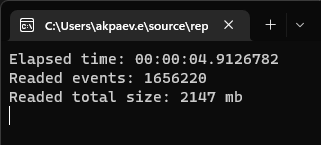

# OnecMonitor

## Служба экспорта и анализа технологического журнала 1С  

Служба решает задачи автоматизации сбора и парсинга действительно больших объемов журнала, в связи с чем, разработка ведется с упором на обеспечение максимальной скорости работы. Хранилищем данных выступает ClickHouse.

Результаты чтения и парсинга full журнала (один поток, core i9, nvme диск):  

### Приложение и документация в разработке. До выхода в релиз, функциональность и внешний вид интерфейса могут непредсказуемо меняться!  

### Состав приложения:  
- *onecmonitor-agent* - агент, занимающийся управлением сбора, чтением и отправкой данных технологического журнала для дальнейшей обработки на сервере
- *onecmonitor-server* - сервер, выполняющий основную работу по разбору данных журнала. Предоставляет доступ к веб-панели управления агентами и просмотра обработанных данных  

Приложение позволяет выполнять анализ цепочек событий  

### Доступные анализы:
- *Анализ управляемых блокировок/взаимоблокировок* - отображает waterfall график событий tlock, наглядно показывая, где именно возникла проблема. Удобством анализа является отображение неявно влияющих блокировок на графике (тех, что отсутствуют в WaitConnections, но пересекаются по блокируемым областям с жертвой)  
- *Анализ цепочек вызовов (call/scall)* - так-же отображает waterfall график. Позволяет увидеть наиболее длительные участки кода  

Доступные анализы (и функционал в целом) по мере доработки будут пополняться.

